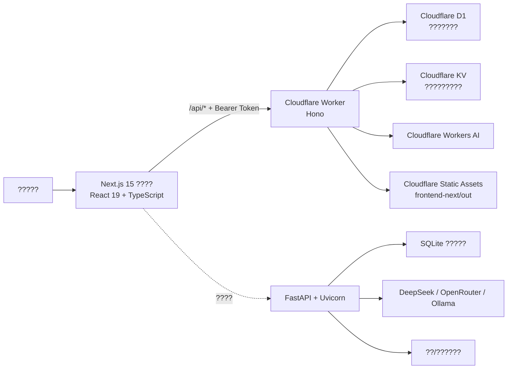
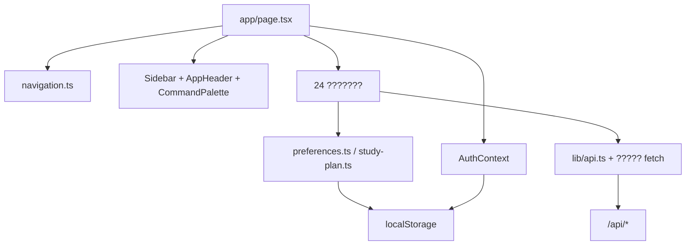
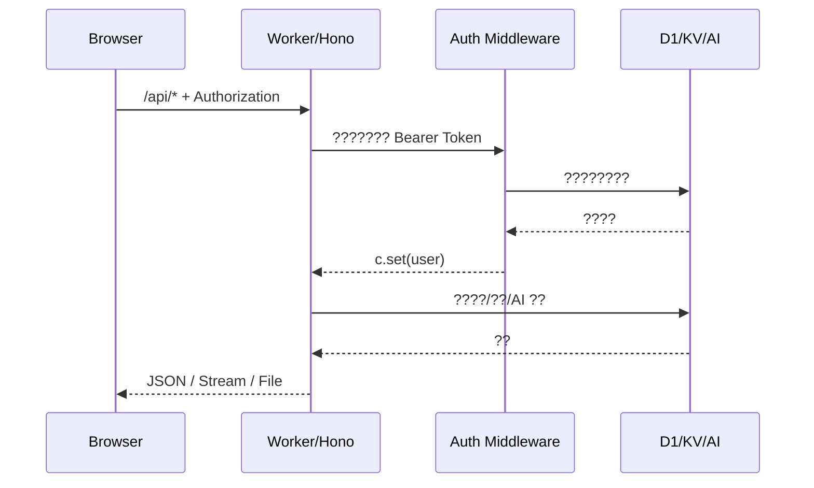
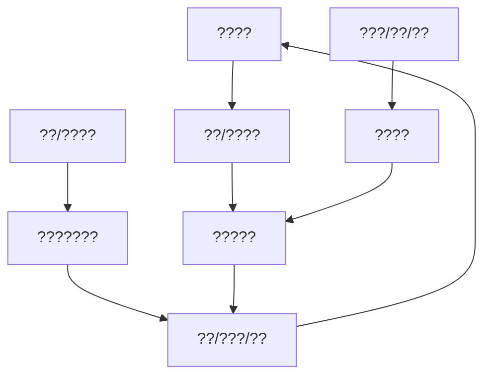

# ?????ARCHITECTURE?

> ?????2026-07-16
> ??????? + ???????

## 1. ????

### ?????

`Browser ? Cloudflare Static Assets ? Worker/Hono ? D1/KV/Workers AI`

### ??????

`Browser ? FastAPI ????/API ? SQLite/???? ? ?? AI Provider`

???????? API ??FastAPI 89 ????Cloudflare 88 ????FastAPI ???????????????????????????????????????

## 2. ????

### 2.1 ????

- `frontend-next/src/app/layout.tsx`
  - ??????????
  - ?? `ErrorBoundary ? ThemeProvider ? AuthProvider`?
  - ?? `globals.css` ? `design-system.css`?
- `frontend-next/src/app/page.tsx`
  - ???????????????
  - ?? `activeTab`????????????????
  - ?? hash ? `localStorage` ???????
  - ? Dashboard ???????? `next/dynamic` ????

### 2.2 ?????

?????????

1. ?????Dashboard?????????????????????????????
2. ???????????????????????
3. AI ???AI ?????????????????
4. ???????????????????????
5. ??????????

`src/lib/navigation.ts` ?????????????????

### 2.3 ??????

### 2.4 ????

??????????

- React Context???????
- ???? State??????????????????
- `localStorage`?token?????????????????????????????????

??? Redux/Zustand/Query??????????????????????????????????????

### 2.5 ????

?????????????? `page.tsx` ?????????? `#tab` ???????????????????????

- ??? URL??????????????
- ????????????????????
- ??? E2E ??????????
- SEO ????????????????????????

## 3. Cloudflare ????

### 3.1 ??

- `index.ts`?CORS??????????????????????????????
- `routes-auth.ts`???????????
- `routes-ai.ts`???????????????????????????
- `routes-content.ts`???????????????
- `routes-knowledge.ts`?????????????????????????
- `routes-learning.ts`??????????????????Dashboard??????
- `db.ts`?D1 ?????????
- `security.ts`?HMAC JWT?PBKDF2 ????
- `file-storage.ts`?KV ????????? 25 MB ??

### 3.2 ???

### 3.3 ????

- ??????? `user_id` ???
- ????? `owner_id IS NULL`?????????????? `owner_id`?
- ?? KV key ???? ID ???????
- ?????? `/api`?`/api/health`?????????????

### 3.4 AI

Cloudflare ?? `AI.run(model, input)`???? `wrangler.jsonc` ? `AI_MODEL` ???AI ?????????????? UI ???????????????/??????

## 4. FastAPI ????

### 4.1 ????

- `main.py` ?????????89 ?????????SQL?????????????? 2,394 ??
- `database.py` ?? sqlite3??????? SQLAlchemy ?????
- ?? lifespan ????????????????????????????????????
- AI Service ?? DeepSeek?OpenRouter ??? Ollama?
- ????????/?????

### 4.2 ??

- ?? sqlite3 ???? async ??????????????????
- ?????????????????????????
- ???????????????????Alembic?python-jose?passlib ???
- ? Cloudflare ????????????????

## 5. ????

### 5.1 ??

- Identity?users
- AI Conversation?conversations?messages
- Knowledge?subjects?chapters?knowledge_points?knowledge_relations?exam_questions?ai_summaries
- Practice?question_bank?exams?wrong_questions
- Memory?flashcards?flashcard_reviews?knowledge_reviews?vocabulary?vocabulary_reviews
- Planning/Activity?study_plans?study_records?study_sessions
- Content/Community?search_index?posts?import_jobs

### 5.2 ???

### 5.3 ????

- `cloudflare/migrations/` ? D1 ???????
- ???????????????
- ??????????????????????????????????????????
- ???? schema ???????????????????????????????

## 6. API ??

?????????? REST ?? API????? `/api`????? Bearer Token??????

- ?? 25 ??????? `lib/api.ts`????????? `fetch`?
- ?? OpenAPI/?? schema ????????
- ?????????????
- `any` ? Worker ????????????
- ????????? `{ detail }`???????????request_id ???????

## 7. ????

### Cloudflare

- `npm run check`?Worker ????
- `npm run build`??? `frontend-next/out`
- `wrangler deploy`??? Worker ?????
- D1 ??? GitHub Actions ??? `workflow_dispatch` ????
- GitHub push ? main ??????????????

### Docker/Railway

- ???????? Next ???????? FastAPI ?????
- SQLite ???????? `/data`?
- `/api/health` ???????

## 8. ???????

??????

- Cloudflare TypeScript noEmit ???
- ?? TypeScript strict noEmit ???
- Python AST ?????
- 28 ? D1 ?????? SQLite ?????

?????

- ??????????API ?????E2E ???
- lint/format ???
- API ?????
- ???????
- ??????????????

## 9. ?????????????

### 9.1 ?????

- Cloudflare Worker + D1/KV/Workers AI ??????????
- ???????????? Cloudflare ??????????????
- ?? API ????????????????? Cloudflare ??????
- D1 ???????????????????????

### 9.2 FastAPI ??

FastAPI ??? Tier B ?????????

- ???????
- ?????????
- DeepSeek/OpenRouter/Ollama ?? Cloudflare AI Provider?
- ? D1/KV ??????? SQLite/???????

FastAPI ????

- Cloudflare ?????????????
- ?????????????
- ??? D1/KV ??????????
- ????????????? SLA?

### 9.3 ??????

| ?? | Cloudflare Tier A | FastAPI Tier B | ?? |
|---|---|---|---|
| ?????????? | ???? | ???? | ?????????Token ??????? |
| ?????????? | ???? | ???? | ???? ID ???????????????? |
| ?????????????? | ???? | ???? | ??????????????????? |
| ??????Dashboard | ???? | ???? | ????????? |
| ??????? | KV ?? | ?????? | ???????????? |
| AI ???? | Workers AI ?? | ?? Provider ?? | ????????????????????? |
| ?? | ???? | ?????? | ?????????????? |
| ??/?? | ???? | ?????? | FastAPI ????????? legacy ?????????? |
| ????/?????? | ???? | ????? | ?????????????? |

### 9.4 API ????

1. ? API ????????????????????
2. Cloudflare ??????????????? FastAPI ?????
3. Tier B ?????????????????
4. ???? API ?????????????????
5. FastAPI ?? `/api/recommendations/subject/{subject_id}` ?? legacy ?????? Cloudflare ????????????

### 9.5 ????

- **?? A??????????** ? ???????????????
- **?? B?????** ? ?? 88 ????????/??/????????????
- **?? C?????** ? Cloudflare ????????????????FastAPI ?????????
- **?? D?????** ? ???????? Worker route?FastAPI main ??? API client?
- **?? E?????** ? ????????????????????? FastAPI?

### 9.6 ?????

- Cloudflare ?????????? Worker/????????????
- D1 ???????????????????????????????
- FastAPI ?????????? FastAPI ???????????????? AI Provider????????????
- ????????????????????????????????????????

## 10. ??????

1. ? Worker ??????? route ? service ? repository/domain?
2. ???? API schema ???????????????
3. ?????????? client/query ??
4. ? hash ????????????????????
5. ?? schema migration ????????
6. ????????????????????????????
