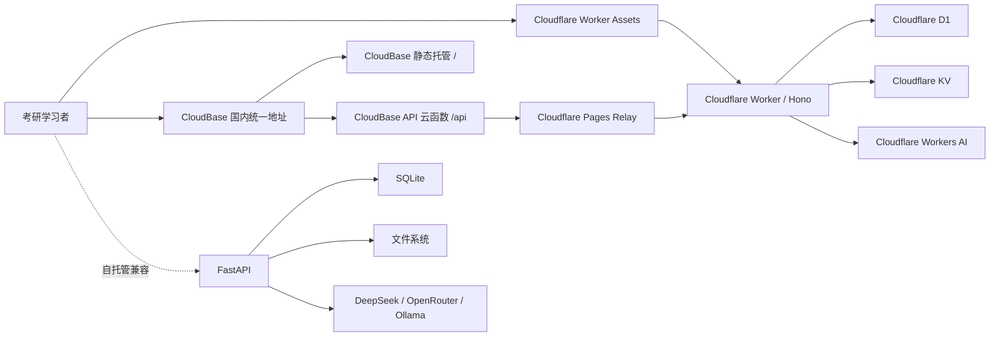

# 系统架构（ARCHITECTURE）

> 最近更新：2026-07-17

## 1. 总体架构



## 2. 运行时定位

### Tier A：Cloudflare

- 唯一商业生产主线；
- 新功能默认实现位置；
- 生产 API、D1 迁移、安全、监控和备份的权威来源；
- 前端静态资源由 Worker Assets 提供。

### 国内免费入口：Tencent CloudBase

- 静态托管与 Cloudflare 使用同一 Next.js 静态导出；
- 默认 HTTP 网关以 `/` 指向静态托管、以 `/api` 指向 `api` 云函数；
- `cloudbase/functions/api/index.js` 透传方法、Authorization、请求体、查询参数、二进制响应、Range 和重定向；
- CloudBase 运行时无法稳定直连 `workers.dev`，因此经 `jiale-cloudbase-relay.pages.dev` 固定目标中继到现有 Worker；
- API 响应强制 `no-store`，避免边缘缓存用户数据；
- 仅改善访问入口，不复制 D1/KV，不改变生产数据权威；
- 免费环境有效期至 2027-01-16 23:59:59；网关和函数响应大小限制使其不适合大于约 4–5.5MB 的响应或现有 25MB 上传。

### 国内备用镜像：EdgeOne Pages

- 已验证同源代理、流式响应、Range 和生产构建；
- 永久公开入口需要自定义域名，因此不作为当前无域名免费方案。

### Tier B：FastAPI

- 本地、自托管和私有部署；
- 保留现有核心功能和关键安全修复；
- 新功能仅在明确批准后同步；
- 不作为 Cloudflare 实时热备；
- 不与 D1/KV 自动同步数据。

## 3. 前端架构

入口：

- `src/app/layout.tsx`：Theme、Auth、ErrorBoundary；
- `src/app/page.tsx`：应用壳、hash 导航、页面动态加载；
- `src/lib/navigation.ts`：导航信息架构；
- `src/lib/api.ts`：API Client；
- `src/components/`：业务页面与全局组件。

状态分层：

- Context：认证、主题；
- 页面 State：查询、表单、考试、复习；
- localStorage：Token、主题、偏好、计时器、兼容缓存；
- 服务端：用户关键业务数据。

当前使用单页壳和 hash 导航；正式 App Router 路由属于后续渐进演进，不进行一次性重写。

## 4. 顶部工具栏

顶部结构：

```text
页面标题 | 全局搜索 | 学习状态 / 积分 / 倒计时 / AI / 专注 / Theme / 消息 / 用户
```

响应式规则：

- 所有 pill/button 保持单行且禁止 flex 收缩；
- 操作区使用内容宽度，不固定为过窄列；
- 小于 1700px 隐藏学习状态和用户文字；
- 小于 1500px 隐藏积分；
- 小于 1320px 隐藏 AI/专注文字，仅保留图标；
- 小于 1180px 隐藏考试倒计时；
- 小于 1023px 隐藏 AI 和专注快捷入口；
- 移动端使用底部快捷导航。

## 5. Cloudflare 模块

- `index.ts`：CORS、认证中间件、健康检查和路由挂载；
- `routes-auth.ts`：注册、登录、用户；
- `routes-ai.ts`：聊天、整理、讲解和 AI 计划；
- `routes-content.ts`：题库、文件、社区、词汇；
- `routes-knowledge.ts`：学科、章节、知识点、图谱、复习和导入；
- `routes-learning.ts`：计划、闪卡、错题、模考、Dashboard、推荐；
- `db.ts`：D1 查询工具；
- `security.ts`：JWT 和密码哈希；
- `file-storage.ts`：KV 文件路径和限制。

## 6. API 边界

- Cloudflare 约 88 个路由；
- FastAPI 约 89 个路由；
- 88 个共享路由需要契约测试；
- FastAPI 独有按学科推荐接口属于 legacy 扩展；
- 新接口先定义请求、响应、权限、错误和幂等；
- 主线完成后再决定是否进入 Tier B。

## 7. 数据领域

- Identity：users
- Conversation：conversations、messages
- Knowledge：subjects、chapters、knowledge_points、relations、exam_questions
- Practice：question_bank、exams、wrong_questions
- Memory：flashcards、knowledge_reviews、vocabulary_reviews
- Planning：study_plans、study_records、study_sessions
- Content：search_index、posts、import_jobs

## 8. 数据规则

- 用户数据以 `user_id` 隔离；
- 公共知识 `owner_id IS NULL`，用户导入使用当前用户 owner；
- 文件 KV key 包含用户 ID；
- SQL 必须参数化；
- 已发布 D1 迁移不可修改；
- 内容种子与 schema migration 后续应逐步分离。

## 9. 部署

### Cloudflare

```text
npm run check
npm run build
wrangler d1 migrations apply DB --remote
wrangler deploy
```

### CloudBase

```text
统一地址 /
  -> STATIC_STORE / staticstore
统一地址 /api
  -> SCF api
  -> jiale-cloudbase-relay.pages.dev
  -> Cloudflare Worker
  -> D1 / KV / Workers AI
```

- 环境：`jiale-graduate-cn-d4d1wu4599e3d4`，上海，免费试用；
- 静态构建：`npm ci --prefix frontend-next` → `npm --prefix frontend-next run build` → `frontend-next/out`；
- 路由：`/` 使用 `STATIC_STORE`，`/api` 使用 `SCF api`，更具体的 `/api` 优先；
- 部署当前使用 CloudBase CLI 手动执行，不在 GitHub Secrets 保存 CLI/API 凭据；
- 到期前必须续期、重新部署或切换入口。

### EdgeOne Pages

```text
GitHub main
  -> edgeone.json（Node 22.11.0）
  -> npm ci + frontend npm ci
  -> npm run check + npm run build
  -> frontend-next/out
  -> cloud-functions/api/[[default]].js
```

- `CLOUDFLARE_UPSTREAM` 只保存 Cloudflare Worker 公网源站；
- 镜像故障不会修改 D1/KV 数据；
- 正式国内自定义域名按适用要求完成 ICP 备案。

### FastAPI

- 根 Dockerfile 构建前端静态资源和 Python 运行时；
- SQLite 与上传目录挂载到 `/data`；
- `/api/health` 用于健康检查。

## 10. 回滚

- Worker 和静态资源回滚到上一版本；
- D1 使用补偿迁移或数据修复脚本；
- 不修改已发布迁移；
- FastAPI 不是无损容灾回退；
- 跨运行时容灾需另行建设数据、文件和密钥复制。

## 11. 当前技术债

- 缺少自动化测试和共享 API 契约；
- Worker 路由和 FastAPI `main.py` 过大；
- 页面中仍有直接 fetch；
- localStorage 与服务端存在部分双数据源；
- 两代 CSS Token 尚未完全收敛；
- 缺少生产监控、告警和备份演练；
- CloudBase 免费入口存在 6MB 级网关限制，暂不支持 25MB 上传；
- CloudBase 部署尚未接入 GitHub 自动发布，续期和部署需人工维护。
