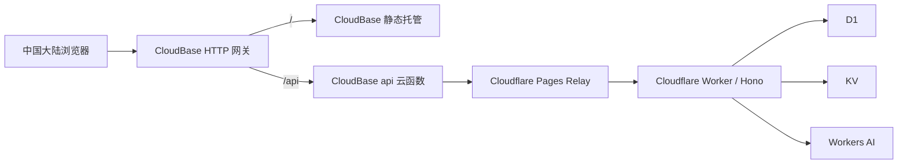

# 中国大陆免费访问部署方案

> 最近更新：2026-07-17
> 当前方案：Tencent CloudBase 免费默认域名
> 数据/API 权威：Cloudflare Worker + D1 + KV + Workers AI

## 1. 目标与原则

目标是在**不购买域名、不迁移数据库、不建立双写**的前提下，为中国大陆用户提供可直接访问的统一入口。

原则：

- Cloudflare 继续是唯一商业生产数据与 API 平面；
- CloudBase 只负责国内静态入口和服务端代理；
- 不把 Cloudflare OAuth Token、API Token、JWT Secret、D1/KV 凭据写入 CloudBase；
- 不承诺免费默认域名具备付费 SLA；
- 到期前必须续期或迁移。

## 2. 当前线上地址

统一国内地址：

```text
https://jiale-graduate-cn-d4d1wu4599e3d4-1454690382.ap-shanghai.app.tcloudbase.com/
```

静态托管默认地址：

```text
https://jiale-graduate-cn-d4d1wu4599e3d4-1454690382.tcloudbaseapp.com/
```

CloudBase 应用地址：

```text
https://jiale-graduate-cn-jiale-graduate-cn-d4d1wu4599e3d4.webapps.tcloudbase.com/
```

Cloudflare Pages Relay：

```text
https://jiale-cloudbase-relay.pages.dev/
```

对外推荐使用第一个**统一国内地址**，因为首页和 `/api/*` 位于同一 Origin。

## 3. 资源信息

- 环境名称：`jiale-graduate-cn`
- 环境 ID：`jiale-graduate-cn-d4d1wu4599e3d4`
- 地域：上海
- 套餐：免费试用
- 费用：0.00 CNY
- 免费资源：3000 点
- 到期时间：2027-01-16 23:59:59
- 云函数：`api`，Node.js 20.19，256MB，120 秒
- Cloudflare Pages 项目：`jiale-cloudbase-relay`

兑换码、CLI 临时凭据和账号授权信息不得写入 Git、文档或日志。

## 4. 请求链路



CloudBase 运行时直连 `workers.dev` 曾出现 `ETIMEDOUT`，因此使用固定目标 Relay。Relay 不允许请求方指定任意上游，避免形成开放代理。

## 5. 路由配置

```text
/      -> STATIC_STORE / staticstore
/api   -> SCF / api
```

`/api` 比 `/` 更具体，因此 API 请求进入云函数，其余请求进入静态站点。

## 6. 手动部署

当前未将 CloudBase 长期凭据写入 GitHub Secrets，部署由已授权的本地 CLI 手动执行。

### 静态站点检查与构建

```powershell
npm run check
npm run build
```

### 部署 CloudBase 云函数

```powershell
npx -y -p @cloudbase/cli tcb fn deploy api -e jiale-graduate-cn-d4d1wu4599e3d4
```

### 部署静态托管

```powershell
npx -y -p @cloudbase/cli tcb hosting deploy frontend-next/out / -e jiale-graduate-cn-d4d1wu4599e3d4
```

### 查询网关路由

```powershell
npx -y -p @cloudbase/cli tcb routes list -e jiale-graduate-cn-d4d1wu4599e3d4 --json
```

Cloudflare Pages Relay 使用其独立 Pages 项目发布；固定上游为现有 Cloudflare Worker。

## 7. 已验证项目

- 统一地址首页成功渲染；
- 1280px 下 `documentElement.scrollWidth === window.innerWidth`，无横向溢出；
- `/api/health` 返回 200，数据库状态为 `connected`；
- 未认证受保护接口返回 401；
- 无效登录 POST 返回上游预期 401；
- Authorization、查询参数、GET/POST、二进制响应、PDF Range 和重定向适配已实现；
- API 响应包含 `no-store`；
- 临时网络诊断函数已删除。

## 8. 免费方案限制

- CloudBase HTTP 网关单次请求/响应约 6MB；
- 代理文本响应保护上限为 5.5MB；
- 代理二进制响应保护上限为 4MB；
- 当前产品允许 25MB 上传，因此超过网关限制的文件无法通过此免费国内入口；
- 免费套餐不支持按量超额；
- 默认域名和免费套餐不提供商业 SLA；
- 需在 2027-01-16 前续期、重新兑换或迁移。

短期建议仅开放小文件上传；大文件需要后续设计直传对象存储、分片上传或明确引导用户切换国际站。

## 9. 后续验收

- 在中国移动、中国联通、中国电信网络分别测试；
- 验证注册、登录、Dashboard、知识库、AI、专注和模考；
- 验证小文件上传、PDF Range 和下载；
- 验证 4MB、5.5MB 和 6MB 边界行为；
- 建立错误率、函数调用量、资源点消耗和到期提醒；
- 在 2027-01-16 前完成续期或迁移决策。

## 10. EdgeOne 备用方案

EdgeOne Pages 镜像代码和项目仍保留。其代理兼容性已验证，但永久公开入口依赖自定义域名，因此不符合当前“不购买域名”的要求。除非后续购买并按适用范围备案域名，否则 CloudBase 默认域名是当前推荐入口。
